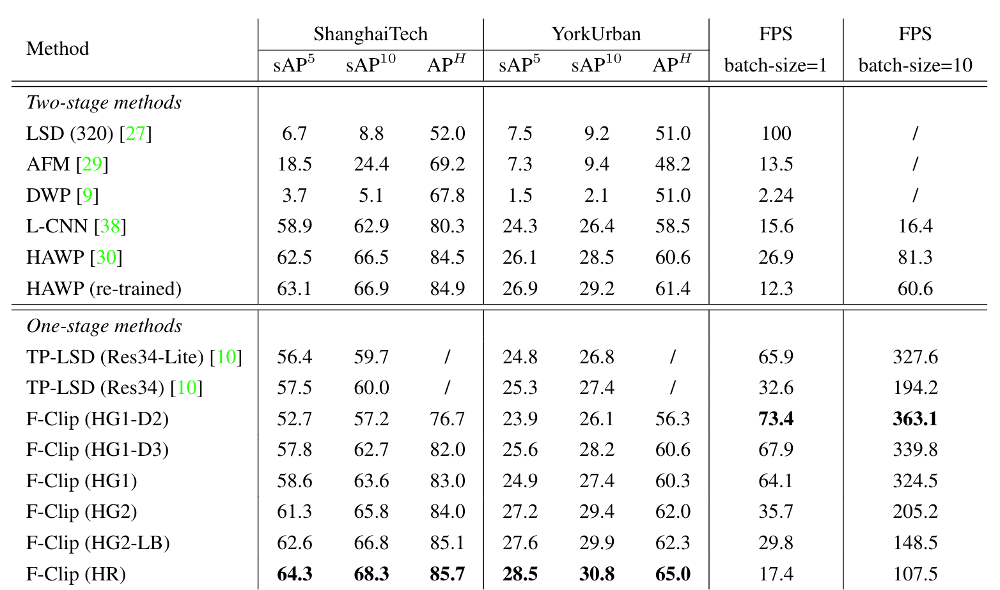

# F-Clip — Fully Convolutional Line Parsing

This repository contains the official PyTorch implementation of the paper: 
*[Xili Dai](https://github.com/Delay-Xili), Haigang Gong, Shuai Wu, [Xiaojun Yuan](https://yuan-xiaojun.github.io/Yuan-Xiaojun/), [Yi Ma](https://people.eecs.berkeley.edu/~yima/). 
["Fully Convolutional Line Parsing."](https://arxiv.org/abs/2104.11207v3) *.

## Introduction

Our method (F-Clip) is a simple and effective neural network for detecting the line from a given image and video. 
It outperforms the previous state-of-the-art wireframe and line detectors by a large margin on both accuracy and speed. 
We hope that this repository serves as a new reproducible baseline for future researches in this area.

## Main results

<p align="center">

</p>

The accuracy and speed trade-off among most recent wireframe detection methods on [ShanghaiTech dataset](https://github.com/huangkuns/wireframe)

### Qualitative Measures
<p align="center">

</p>

More random sampled results can be found in the paper.

### Quantitative Measures

The following table reports the performance metrics of several wireframes and line detectors on the ShanghaiTech dataset.
A detail leader board of the ShanghaiTech and YorkUrban datasets can be found [here](https://github.com/Delay-Xili/Wireframe). 

<p align="center">

</p>

## Reproducing Results

### Installation

For the ease of reproducibility, you are suggested to install [miniconda](https://docs.conda.io/en/latest/miniconda.html) (or [anaconda](https://www.anaconda.com/distribution/) if you prefer) before following executing the following commands. 

```bash
git clone https://github.com/Delay-Xili/F-Clip
cd F-Clip
conda create -y -n fclip
source activate fclip
# Replace cudatoolkit=10.1 with your CUDA version: https://pytorch.org/
conda install -y pytorch cudatoolkit=10.1 -c pytorch
conda install -y pyyaml docopt matplotlib scikit-image opencv
mkdir data logs post
```

### Testing Pre-trained Models

You can download our reference 6 pre-trained models HG1_D2, HG1_D3, HG1, HG2, HG2_LB, and HR from [Google
Drive](https://drive.google.com/file/d/1jMZB-kYTNAGaVPW0FBLTAQMc3m3vR-_P/view?usp=sharing).  Those models were
trained with their corresponding settings `config/fclip_xxx.yaml`.  
To generate wireframes on the validation dataset with the pretrained model, execute

```bash
python test.py -d 0 -i <directory-to-storage-results> config/fclip_xxx.yaml <path-to-xxx-ckpt-file> shanghaiTech/york <path-to-validation-set>
```


### Detect Wireframes for Your Own Images or Videos
To test F-Clip on your own images or videos, you need to download the pre-trained models and execute

```Bash
CUDA_VISIBLE_DEVICES=0 python demo.py <path-to-image-or-video> --model HR --output_dir logs/demo_result --ckpt <path-to-pretrained-pth> --display True
```
Here, `--output_dir` is specifying the directory where the results will store, and you can specify `--display` to see the results on time.


### Downloading the Processed Dataset
You can download the processed dataset `wireframe.zip` and `york.zip` manually from Google
Drive ([link1](https://drive.google.com/file/d/1q8pQzYBJPh3brHUhjkVIxfbLk0XEigIe/view?usp=sharing), 
[link2](https://drive.google.com/file/d/1lapVcNtw7SNzH8cpHj2H6tIzyAom4MJe/view?usp=sharing)). 

#### Processing the Dataset
*Optionally*, you can pre-process (e.g., generate heat maps, do data augmentation) the dataset from
scratch rather than downloading the processed one.  

```bash
dataset/wireframe.py data/wireframe_raw data/wireframe
dataset/wireframe_line.py data/wireframe_raw data/wireframe
```


### Evaluation

To evaluate the sAP (recommended) of all your checkpoints under `logs/`, execute
```bash
python eval-sAP.py logs/*/npz/*
```

**MATLAB is required for AP<sup>H</sup> evaluation** and `matlab` should be under your
`$PATH`.  The **parallel computing toolbox** is highly suggested due to the usage of `parfor`.
After post processing, execute

```bash
python eval-APH.py pth/to/input/npz pth/to/output/dir
```
Due to the usage of pixel-wise matching, 
the evaluation of AP<sup>H</sup> **may take up to an hour** depending on your CPUs.
See the source code of `eval-sAP.py`, `eval-APH.py`, and `FClip/postprocess.py` for more
details on evaluation.

### Training
To train the neural network on GPU 0 (specified by `-d 0`) with the different 6 parameters, execute
```bash
python train.py -d 0 -i HG1_D2 config/fclip_HG1_D2.yaml
python train.py -d 0 -i HG1_D3 config/fclip_HG1_D3.yaml
python train.py -d 0 -i HG1 config/fclip_HG1.yaml
python train.py -d 0 -i HG2 config/fclip_HG2.yaml
python train.py -d 0 -i HG2_LB config/fclip_HG2_LB.yaml
python train.py -d 0 -i HR config/fclip_HR.yaml
```


### Acknowledgement
We thank [Yichao Zhou](https://github.com/zhou13) and [Haozhi Qi](https://github.com/HaozhiQi) of Berkeley for
their help during all processes include ideas and experiments. This project would not have been possible
without their help.


### Citation

If you find F-Clip useful in your research, please consider citing:

```
@article{DAI20221,
title = {Fully convolutional line parsing},
journal = {Neurocomputing},
volume = {506},
pages = {1-11},
year = {2022},
issn = {0925-2312},
doi = {https://doi.org/10.1016/j.neucom.2022.07.026},
url = {https://www.sciencedirect.com/science/article/pii/S0925231222008852},
author = {Xili Dai and Haigang Gong and Shuai Wu and Xiaojun Yuan and Ma Yi},
}
```
