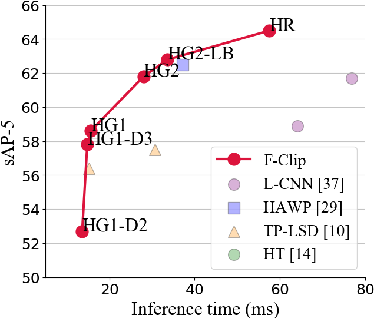

# F-Clip — Fully Convolutional Line Parsing

This repository contains the official PyTorch implementation of the paper: *[Xili Dai](https://github.com/Delay-Xili), [Yichao Zhou](https://yichaozhou.com), [Haozhi Qi](http://haozhi.io), [Yi Ma](https://people.eecs.berkeley.edu/~yima/). ["Fully Convolutional Line Parsing."]()  CVPR 2021*.

## Introduction

[F-Clip]() is a simple and effective neural network for detecting the line from a given image and video. 
It outperforms the previous state-of-the-art wireframe and line detectors by a large margin on both accuracy and speed. 
We hope that this repository serves as a new reproducible baseline for future researches in this area.

Here are the line detection and tracking results running on the video from [link](https://www.facebook.com/watch/?v=1334579700223691).

<p align="center">

</p>

## Main results

<p align="center">

</p>

The accuracy and speed trade-off among most recent wireframe detection methods on [ShanghaiTech dataset](https://github.com/huangkuns/wireframe)

### Qualitative Measures
<p align="center">

</p>

More random sampled results can be found in the [supplementary material]() of the paper.

### Quantitative Measures

The following table reports the performance metrics of several wireframe and line detectors on the ShanghaiTech dataset.

<p align="center">

</p>

## Reproducing Results

### Installation

For the ease of reproducibility, you are suggested to install [miniconda](https://docs.conda.io/en/latest/miniconda.html) (or [anaconda](https://www.anaconda.com/distribution/) if you prefer) before following executing the following commands. 

```bash
git clone https://github.com/Delay-Xili/F-Clip
cd F-Clip
conda create -y -n fclip
source activate fclip
# Replace cudatoolkit=10.1 with your CUDA version: https://pytorch.org/
conda install -y pytorch cudatoolkit=10.1 -c pytorch
conda install -y pyyaml docopt matplotlib scikit-image opencv
mkdir data logs post
```

### Pre-trained Models

You can download our reference 5 pre-trained models [HG1_320](), [HG1](), [HG2](), [HG2_LB](), and [HGR]() from Google
Drive.  Those models were
trained with `config/fclip_xxx.yaml`.  Use `demo.py`, `test.py`, and
`eval-*.py` to evaluate the pre-trained models.

### Detect Wireframes for Your Own Images or Videos
To test F-Clip on your own images or videos, you need download the pre-trained models and execute

```Bash
CUDA_VISIBLE_DEVICES=0 python ./demo.py <path-to-image-or-video> --model HR --output_dir logs/demo_result --ckpt <path-to-pretrained-pth> --display True
```
Here, `--output_dir` is specifying the directory where the results will stored, and you can specify `--display` to see the results on time.


### Downloading the Processed Dataset
To-be-determined

### Training
To train the neural network on GPU 0 (specified by `-d 0`) with the default parameters, execute
```bash
python ./train.py -d 0 --identifier baseline config/fclip_HG1.yaml
```

## Testing Pretrained Models
To generate wireframes on the validation dataset with the pretrained model, execute

```bash
python ./train.py -d 0 --identifier <directory-to-storage-results> config/fclip_HG1.yaml <path-to-pretrained-pth>
```

### Evaluation

To evaluate the sAP (recommended) of all your checkpoints under `logs/`, execute
```bash
python eval-sAP.py logs/*/npz/*
```

To evaluate AP<sup>H</sup>, you first need to post process your result (see the Post Process section on [lcnn](https://github.com/zhou13/lcnn)).
In addition, **MATLAB is required for AP<sup>H</sup> evaluation** and `matlab` should be under your
`$PATH`.  The **parallel computing toolbox** is highly suggested due to the usage of `parfor`.
After post processing, execute

```bash
python eval-APH.py post/RUN-ITERATION/0_010 post/RUN-ITERATION/0_010-APH
```
to get the plot, where `0_010` is the threshold used in the post processing, and `post/RUN-ITERATION-APH`
is the temporary directory storing intermediate files.  Due to the usage of pixel-wise matching, 
the evaluation of AP<sup>H</sup> **may take up to an hour** depending on your CPUs.

See the source code of `eval-sAP.py`, `eval-APH.py`, and `FClip/postprocess.py` for more
details on evaluation.

